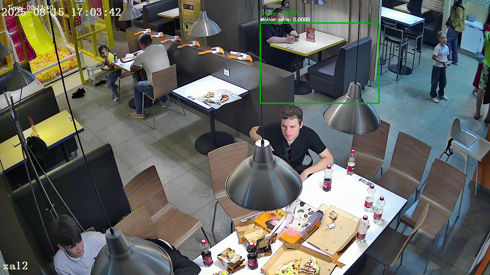

# Детекция состояния столика по видео

## 1. Установка

```bash
python3 -m venv .venv
source .venv/bin/activate
pip install -r requirements.txt
```

## 2. Видео

Тестировалось на **Видео 1**:
- https://drive.google.com/file/d/1pAPTjESoDgjqhTaqM_graYfMpWcOyzRe/view?usp=sharing

Скачать можно так:

```bash
gdown 1pAPTjESoDgjqhTaqM_graYfMpWcOyzRe -O video1.mp4
```

## 3. Запуск

```bash
python main.py --video video1.mp4
```

После запуска создаются файлы:
- `output.mp4` — видео с визуализацией состояния столика
- `events.csv` — таблица событий (Pandas DataFrame, выгруженный в CSV)
- `summary.txt` — краткий отчет с метрикой

Дополнительно:
- `--table-roi x,y,w,h` — задать ROI вручную
- `--select-roi` — выбрать ROI интерактивно через `cv2.selectROI`

## 4. Выбранный столик

Для `video1.mp4` выбран столик в верхней центральной зоне (кабинки справа):
- **ROI:** `x=1360, y=120, w=620, h=420`
- Координаты сначала выбирались вручную через `cv2.selectROI` (`--select-roi`), затем зафиксированы в коде для повторяемого запуска.

## 5. Логика детекции

1. На каждом кадре применяется вычитание фона (`cv2.createBackgroundSubtractorMOG2`).
2. Анализируется только ROI выбранного столика.
3. В ROI считается доля foreground-пикселей (`motion_ratio`).
4. Состояние задается автоматом:
- `EMPTY` (пусто)
- `OCCUPIED` (занято)
- `APPROACH` (событие перехода после периода пустоты)
5. Чтобы не было дрожания состояний, используются:
- `occupied_hold_sec`
- `min_state_change_sec`
- `warmup_sec`

## 6. Полученный результат

Результат на полном `video1.mp4`:
- `events_total = 47`
- `approach_events = 15`
- **Среднее время между состоянием EMPTY и следующим APPROACH:** `33.473 сек`

## 7. Пример проблемного кадра

На кадре ниже человек сидит в ROI, но состояние `EMPTY`. Такое бывает, когда человек долго почти не двигается.


